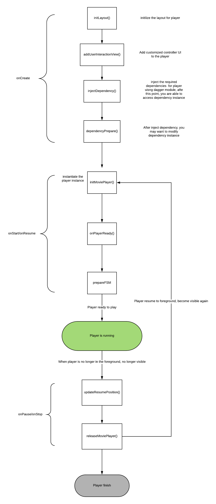

# TubiPlayer
The official android player of [Tubi TV](https://play.google.com/store/apps/details?id=com.tubitv) -- A free movie and TV streaming service.

## Purposes of TubiPlayer
In the industry of streaming free multi-media contents to users, companies choose to show in-stream video ads to users between the main content as their business model. Examples include **YouTube** and **Tubi TV**.

From the technology side of things, in order to implement an android player that streams multiple media very well, switches between movies and ads dynamically, and presents users with a seamless user experience, it requires a series of stateful actions that poses a lot of complexities for enginners to manage. **TubiPlayer offers an industry standard, multi-media streaming and ad-supported solution on the Android platform, with highly customized code architecture and implementation**

## What TubiPlayer Does Well.
* Native multi-media streaming on Android
* Industry standard Ad solutions, including VAST and VPAID
* Error-handing
* Seamless UX 
* Highly customized module


## Dependency Management
In order to provide a highly customized code base, we have leveraged [Dagger's](https://github.com/google/dagger) dependency management framework to better manage dependencies for your own business logic.(We recommend having a decent understanding of how Dagger works before making changes to our code)
Our goal is to provide flexibility. Let's say your business requires the use of multiple ads of different types, playing at different positions. TubiPlayer's dependency management provides the basic classes and functionality
to implement a playback experience.
You can choose to use the default behavior by using the module out of box, but if you need to change how the player is implemented to suit your particular needs, you only need to override the classes or functions relevant to your project's requirements. This way you can setup and use TubiPlayer quickly and easily without the need to thoroughly understand the entire code base.

Nearly every business related dependency is managed by [PlayerModuleDefault](./lib/src/main/java/com/tubitv/media/di/PlayerModuleDefault.java), with each dependency being instantiated and being injected into [DoubleViewTubiPlayerActivity](./lib/src/main/java/com/tubitv/media/activities/DoubleViewTubiPlayerActivity.java)
If you have customized business logic, you can directly change the dependencies in  [PlayerModuleDefault](./lib/src/main/java/com/tubitv/media/di/PlayerModuleDefault.java).

## How to use
Different applications often require different sets of rules and logic to satisfy business requirements. As a result, Tubiplayer was built to provide high degree of
customization. However, highly customizable code, if not managed well, can quickly turn into a nightmare. Therefore, Tubiplayer leverages the third party Dependency Injection framework,[Dagger](https://github.com/google/dagger) 
to provide the best of both worlds.

### Different use cases:
1. If you just simply want to play a video without any forms of interruption, you can just use ***DoubleViewTubiPlayerActivity*** out of box. The code starts a self contained activity to handle your playback experience
```java
      String subs = "http://put_your_own_subtitle.srt";
                 String artwork = "http://www.put_your_own_art_work.png";
                 String name = "Example Video";
                 String video_url = "http://put_your_own_video_url.mp4";
                 Intent intent = new Intent(SelectionActivity.this, DoubleViewTubiPlayerActivity.class);
                 intent.putExtra(TubiPlayerActivity.TUBI_MEDIA_KEY, MediaModel.video(name, video_url, artwork, null));
                 startActivity(intent);
```

2. If you want to implement pre-roll or middle-roll video ads, use the DoubleViewTubiPlayerActivity implementation from step 1, and then follow the additional steps:
    1. First, the presumption is that all the video ads need to be real time and dynamic, meaning all the ads are not fetched until they are needed. If you choose not to do real time, you can hardcode CuePoints or Ad Response for a fixed logic.
    2. You need to know at the beginning of playback at which positions ads may need to show. All the video ads need to be real time and dynamic, meaning they are not fetched until they are needed.
       We call the list of positions during the main video to fetch ads from server ***CuePoints***.
    3. When the main video reaches a CuePoint, you need to fetch the ads from your desired repository. It can return any number of ads to display during this CuePoint, including none at all.
    4. Finally, The **[AdInterface](./lib/src/main/java/com/tubitv/media/fsm/callback/AdInterface.java)** is the interface that defines contracts for getting ***Cuepoints*** and ***Ad Responses*** between Tubiplayer core and remote server,
       you have option to do both ***asynchronous*** and ***synchronous*** operation with it.
        1. ***void fetchAd(AdRetriever retriever, RetrieveAdCallback callback)*** 
        2. ***void fetchQuePoint(CuePointsRetriever retriever, CuePointCallBack callBack)***
        
    5. If you want to quickly test the pre-roll and mid-roll video ads using the default components, just simply change 1 line of code in [PlayerModuleDefault](lib/src/main/java/com/tubitv/media/di/PlayerModuleDefault.java#L131): <br/>  
    ```java
  
       @Override
       public void fetchQuePoint(CuePointsRetriever retriever, CuePointCallBack callBack) {
    
           callBack.onCuePointReceived(new long[] {0, 60000, 900000, 1800000, 3600000 });
                //"AdBreak point at 0s, 1min, 15min, 30min, 60min. With each adbreak showing one ads"
       }
   
    ```
    Then, run the demo app, and see the testing pre-roll and mid-roll ads.
        

## Player Lifecycle
The Tubiplayer's lifecycle is bound to the Activity's lifecycle for better resource management. Refer to this chart if you want to add customized business logic in Tubiplayer's lifecycle:


## State Machine Diagram
The business logic of switching ads is complicated and stateful. In order to provide better state management, the diagrams below demonstrate the state transitions. Refer to
this diagram when adding your customized logic:


## License
MIT License

Copyright (c) 2017 Tubitv

Permission is hereby granted, free of charge, to any person obtaining a copy
of this software and associated documentation files (the "Software"), to deal
in the Software without restriction, including without limitation the rights
to use, copy, modify, merge, publish, distribute, sublicense, and/or sell
copies of the Software, and to permit persons to whom the Software is
furnished to do so, subject to the following conditions:

The above copyright notice and this permission notice shall be included in all
copies or substantial portions of the Software.

THE SOFTWARE IS PROVIDED "AS IS", WITHOUT WARRANTY OF ANY KIND, EXPRESS OR
IMPLIED, INCLUDING BUT NOT LIMITED TO THE WARRANTIES OF MERCHANTABILITY,
FITNESS FOR A PARTICULAR PURPOSE AND NONINFRINGEMENT. IN NO EVENT SHALL THE
AUTHORS OR COPYRIGHT HOLDERS BE LIABLE FOR ANY CLAIM, DAMAGES OR OTHER
LIABILITY, WHETHER IN AN ACTION OF CONTRACT, TORT OR OTHERWISE, ARISING FROM,
OUT OF OR IN CONNECTION WITH THE SOFTWARE OR THE USE OR OTHER DEALINGS IN THE
SOFTWARE.
